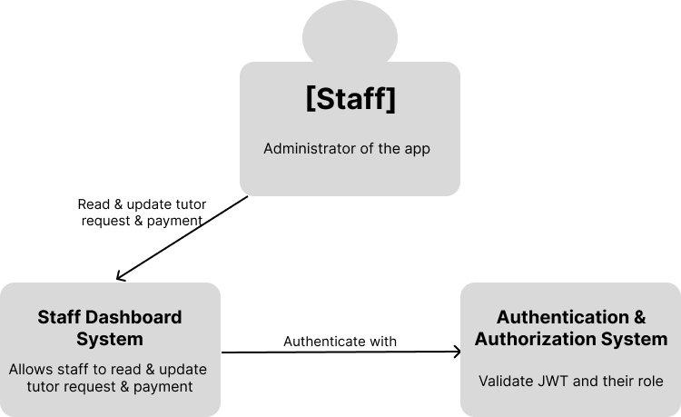
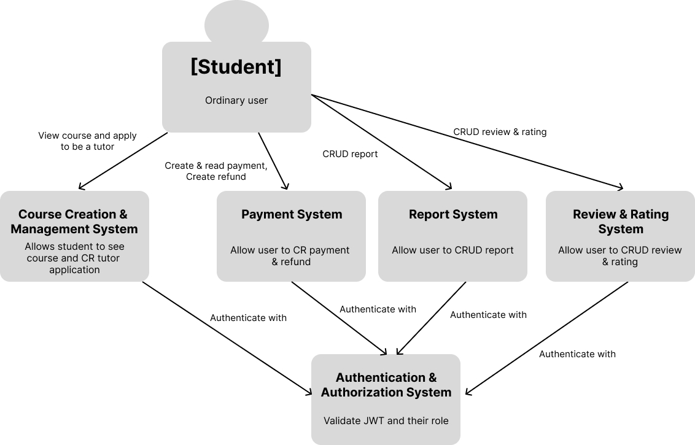
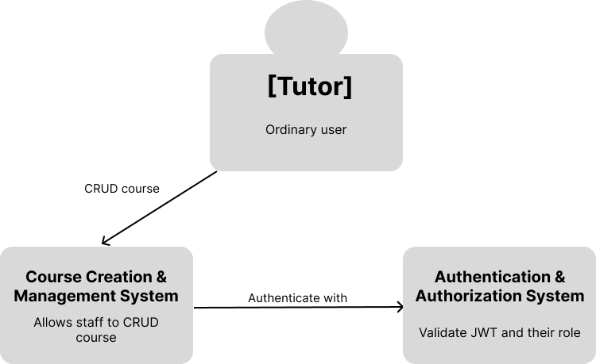
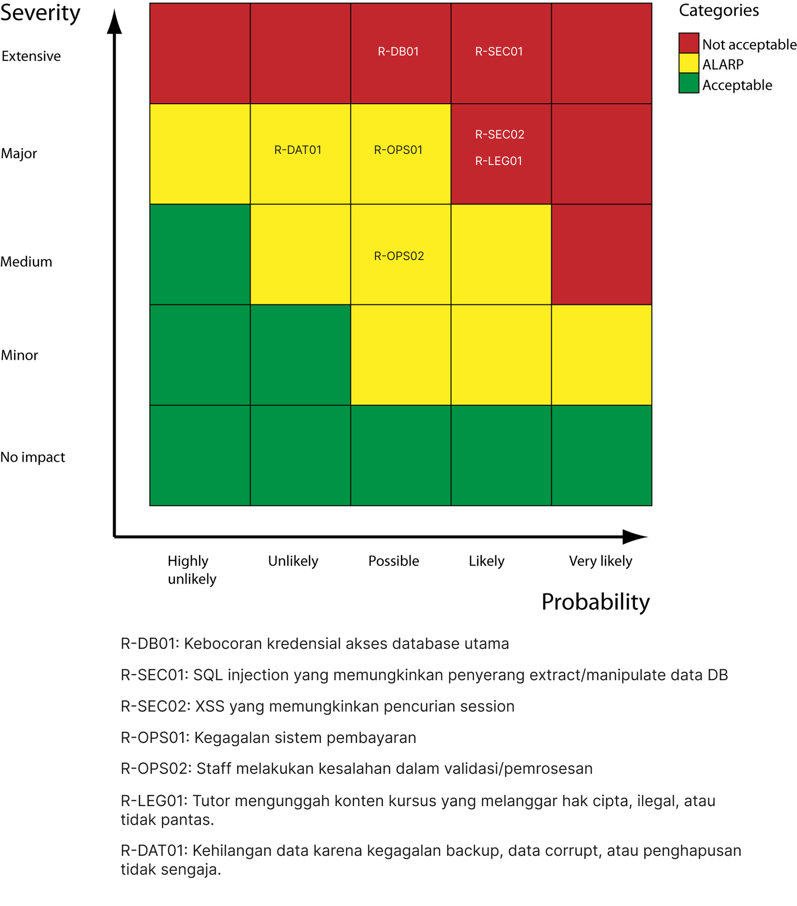
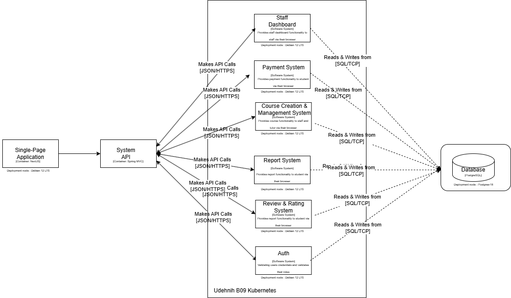

## 👥 Kelompok B09
Selamat datang di repositori kelompok B09!
| Nama | NPM | Github | 
| -- | -- | -- |
| Grace Karina | 2306275834 | gracekarinn |
| Athallah Damar Jiwanto | 2306245024 | athallahd
| Muhammad Naufal Ramadhan | 2306241700 | naufal-ramadhan |
| Darren Aldrich | 2306206856 | Dardrich
| I Dewa Putu Aditya Rahman | 2106650456 |  idpadt  |
| Yasmine Putri Viryadhani | 2206081862 | sdikyarts |

### C4 Model of The Current Architecture

#### Context Diagram (Grace)

- Staff

- Student 

- Tutor 

#### Container Diagram (Aditya)

- Authentication & Authorization System

- Course Creation & Management System 

- Payment System

- Staff Dashboard System

- Report System

- Review & Rating System

#### Risk Matrix (Darren)

#### Architecture Modification Justification (Yasmin)

Berdasarkan matriks risiko yang diberikan, berikut adalah justifikasi modifikasi arsitektur untuk mengatasi risiko-risiko yang diidentifikasi:
1. Risiko Kategori "Not Acceptable" (Merah): R-DB01, R-SEC01, R-SEC02, R-OPS01, R-LEG01
  - R-DB01 (Kebocoran Kredensial Akses Database Utama - Extensive, Very Likely): Risiko ini sangat kritis karena probabilitasnya tinggi dan dampaknya ekstrem. Modifikasi arsitektur yang diperlukan adalah implementasi pengelolaan kredensial yang aman (misalnya menggunakan vault seperti HashiCorp Vault), enkripsi kredensial, dan penerapan prinsip least privilege untuk akses database.
  - R-SEC01 (SQL Injection yang Memungkinkan Penyerang Extract/Manipulate Data DB - Extensive, Likely): Risiko ini juga kritis. Modifikasi arsitektur meliputi penggunaan prepared statements atau ORM (seperti Hibernate) untuk mencegah SQL injection, serta penerapan input validation dan sanitasi ketat pada semua input pengguna.
  - R-SEC02 (XSS yang Memungkinkan Pencurian Session - Major, Very Likely): Dengan probabilitas tinggi, risiko ini perlu ditangani dengan output encoding (misalnya menggunakan library seperti OWASP ESAPI), penerapan Content Security Policy (CSP), dan validasi input untuk mencegah eksekusi skrip berbahaya.
  - R-OPS01 (Kegagalan Sistem Pembayaran - Major, Likely): Untuk mengatasi risiko ini, arsitektur harus dimodifikasi dengan menambahkan sistem fallback untuk pembayaran, menggunakan gateway pembayaran yang andal, dan menerapkan monitoring real-time untuk mendeteksi kegagalan sistem.
  - R-LEG01 (Tutor Mengunggah Konten Kursus yang Melanggar Hak Cipta, Ilegal, atau Tidak Pantas - Major, Likely): Modifikasi arsitektur meliputi penerapan sistem moderasi konten otomatis (misalnya menggunakan AI untuk deteksi konten ilegal) dan kebijakan audit konten sebelum dipublikasikan.
2. Risiko Kategori "ALARP" (Kuning): R-DATA01, R-OPS02
  - R-DATA01 (Kehilangan Data karena Kegagalan Backup, Data Corrupt, atau Penghapusan Tidak Sengaja - Major, Unlikely): Meskipun probabilitasnya rendah, dampaknya besar. Modifikasi arsitektur yang disarankan adalah penerapan sistem backup otomatis dengan penyimpanan di lokasi terpisah (misalnya cloud), serta pemulihan data yang teruji secara berkala.
  - R-OPS02 (Staff Melakukan Kesalahan dalam Validasi/Pemrosesan - Medium, Possible): Risiko ini dapat dikurangi dengan modifikasi arsitektur berupa otomatisasi proses validasi menggunakan aturan bisnis yang jelas dan penerapan pelatihan berkala untuk staff.
  - Risiko Kategori "Acceptable" (Hijau): Tidak ada risiko dalam kategori ini yang ditampilkan pada matriks, sehingga tidak memerlukan modifikasi arsitektur mendesak.

Kesimpulan:
Modifikasi arsitektur harus diprioritaskan pada risiko kategori "Not Acceptable" karena memiliki dampak dan probabilitas tinggi. Langkah-langkah seperti pengelolaan kredensial aman, pencegahan SQL injection/XSS, sistem moderasi konten, dan otomatisasi proses akan meningkatkan keamanan dan keandalan sistem. Risiko "ALARP" juga perlu diperhatikan dengan solusi seperti backup otomatis untuk meminimalkan dampak potensial.

#### Deployment Diagram (Naufa, Damar)
